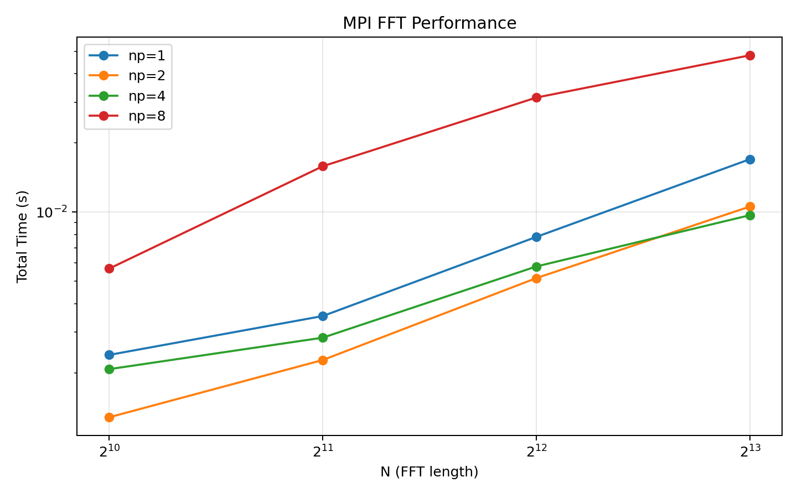
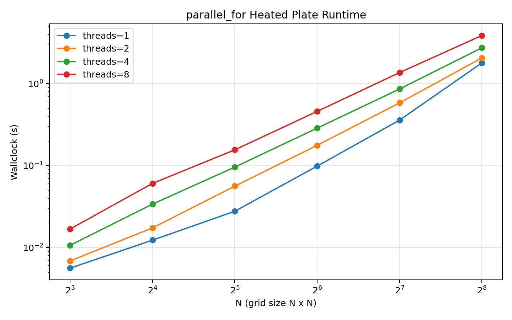
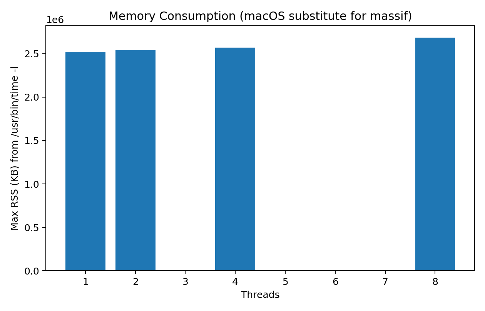

# 中山大学 计算机学院本科生实验报告

**（2025/2026学年）**

| 课程名称 | 并行程序设计与算法（实验） | 批改人 | |
| :--- | :--- | :--- | :--- |
| **实验** | Lab 7 - MPI并行应用与parallel_for并行性能分析 | **专业（方向）** | 计算机科学与技术（人工智能） |
| **学号** | 23336103 | **姓名** | 雷颜玮 |
| **Email** | leiyanwei2005@163.com | **完成日期** | 2026年5月27日 |

---

## 1. 实验要求与目的

1. 使用 MPI 对 `fft_serial.cpp` 进行并行化，实现多进程 FFT。
2. 对 Lab6 中 `parallel_for` 版本 heated plate 应用进行并行规模与问题规模分析。
3. 采集并分析程序内存消耗数据（本机 macOS 环境无法使用 valgrind massif，采用 `/usr/bin/time -l` 实测最大驻留内存作为替代观测指标）。

## 2. 实验环境

- OS: macOS (Apple Silicon)
- 编译器: `mpic++ (Open MPI 5.0.9)`, `g++`
- MPI: Open MPI 5.0.9
- 线程库: pthread
- 绘图: matplotlib

## 3. 实现说明

### 3.1 MPI 并行 FFT（任务一）

实现文件：`lab7/src/mpi_fft.cpp`

核心思路：
1. 将长度为 `N` 的复数向量按块分配到各进程。
2. 每层蝶形计算前通过 `MPI_Allgather` 同步全局数据。
3. 各进程只更新自己负责的局部区间。
4. 正向 FFT 后再逆向 FFT，计算与原始输入的 RMS 误差。

### 3.2 parallel_for Heated Plate（任务二）

实现文件：`lab7/src/heated_plate_parallel_for.cpp`

说明：
1. 沿用 Lab6 的 `parallel_for + functor` 模式（`copy/update/diff` 三阶段）。
2. 为满足 Lab7 的规模分析要求，将网格规模改为运行参数 `N`（即 `N x N`）。
3. 保留互斥锁更新全局 `diff` 的同步方式，以保证与 Lab6 设计一致。

## 4. 核心代码呈现

### 4.1 MPI FFT 的核心蝶形并行计算

```cpp
static void fft_mpi_1d(std::vector<std::complex<double>>& local,
                       std::vector<std::complex<double>>& global,
                       int n,
                       int rank,
                       int size,
                       int sign) {
  const int local_n = n / size;
  const int bits = static_cast<int>(std::log2(n));

  MPI_Allgather(local.data(), local_n, MPI_CXX_DOUBLE_COMPLEX, global.data(), local_n,
                MPI_CXX_DOUBLE_COMPLEX, MPI_COMM_WORLD);
  for (int loc = 0; loc < local_n; ++loc) {
    const int idx = rank * local_n + loc;
    local[loc] = global[bit_reverse(idx, bits)];
  }

  for (int len = 2; len <= n; len <<= 1) {
    const int half = len >> 1;
    MPI_Allgather(local.data(), local_n, MPI_CXX_DOUBLE_COMPLEX, global.data(), local_n,
                  MPI_CXX_DOUBLE_COMPLEX, MPI_COMM_WORLD);

    std::vector<std::complex<double>> next(local_n);
    for (int loc = 0; loc < local_n; ++loc) {
      const int idx = rank * local_n + loc;
      const int block = (idx / len) * len;
      const int j = idx - block;
      if (j < half) {
        const int i1 = idx;
        const int i2 = idx + half;
        const double ang = sign * -2.0 * M_PI * static_cast<double>(j) / static_cast<double>(len);
        const std::complex<double> w = std::polar(1.0, ang);
        next[loc] = global[i1] + w * global[i2];
      } else {
        const int jp = j - half;
        const int i1 = idx - half;
        const int i2 = idx;
        const double ang = sign * -2.0 * M_PI * static_cast<double>(jp) / static_cast<double>(len);
        const std::complex<double> w = std::polar(1.0, ang);
        next[loc] = global[i1] - w * global[i2];
      }
    }
    local.swap(next);
  }
}
```

### 4.2 parallel_for 线程分块调度核心实现

```cpp
void parallel_for(int start, int end, int inc, void* (*functor)(int, void*), void* arg,
                  int n_threads) {
  int total_iterations = (end - start + inc - 1) / inc;
  if (n_threads > total_iterations) n_threads = total_iterations;

  int iter_per_thread = total_iterations / n_threads;
  int remainder = total_iterations % n_threads;

  for (int i = 0, current_iter = 0; i < n_threads; ++i) {
    int iters_for_this_thread = iter_per_thread + (i < remainder ? 1 : 0);
    t_data[i].start = start + current_iter * inc;
    t_data[i].end = t_data[i].start + iters_for_this_thread * inc;

    pthread_create(&threads[i], nullptr,
      [](void* p) -> void* {
        ThreadData* data = static_cast<ThreadData*>(p);
        for (int k = data->start; k < data->end; k += data->inc) {
          data->functor(k, data->arg);
        }
        return nullptr;
      },
      &t_data[i]);

    current_iter += iters_for_this_thread;
  }

  for (int i = 0; i < n_threads; ++i) pthread_join(threads[i], nullptr);
}
```

### 4.3 Heated Plate 三阶段并行更新核心代码

```cpp
while (diff >= epsilon) {
  parallel_for(0, n, 1, copy_functor, &wd, num_threads);
  parallel_for(1, n - 1, 1, update_functor, &wd, num_threads);
  global_diff = 0.0;
  parallel_for(1, n - 1, 1, diff_functor, &wd, num_threads);
  diff = global_diff;
  ++iters;
}
```

## 5. 实验数据采集方式

统一脚本：`lab7/scripts/run_all_benchmarks.sh`

- FFT 原始日志：`lab7/data/fft_np*_N*.log`
- FFT 汇总：`lab7/data/fft_results.csv`
- Heated Plate 原始日志：`lab7/data/hp_N*_t*.log`
- Heated Plate 汇总：`lab7/data/heated_plate_results.csv`
- 内存观测日志：`lab7/data/time_l_t*.log`
- 内存汇总：`lab7/data/heated_plate_memory_time_l.csv`

## 6. 实验结果

### 6.1 MPI FFT 数值正确性

在全部 `np={1,2,4,8}` 与 `N={1024,2048,4096,8192}` 组合下，误差均约 `2e-16`，属于双精度浮点计算误差范围，结果正确。

### 6.2 MPI FFT 性能数据

| np | N | total_time(s) | mflops |
|---:|---:|---:|---:|
| 1 | 1024 | 0.002391 | 428.27 |
| 2 | 1024 | 0.001280 | 800.00 |
| 4 | 1024 | 0.002073 | 493.97 |
| 8 | 1024 | 0.005677 | 180.38 |
| 1 | 4096 | 0.007802 | 629.99 |
| 2 | 4096 | 0.005163 | 952.00 |
| 4 | 4096 | 0.005801 | 847.30 |
| 8 | 4096 | 0.031515 | 155.96 |
| 1 | 8192 | 0.016999 | 626.48 |
| 2 | 8192 | 0.010577 | 1006.86 |
| 4 | 8192 | 0.009699 | 1098.01 |
| 8 | 8192 | 0.048131 | 221.26 |



### 6.3 Heated Plate 并行规模与问题规模分析（真实测量）

测试规模：`N={8,16,32,64,128,256}`，线程数 `t={1,2,4,8}`。

| N | t=1(s) | t=2(s) | t=4(s) | t=8(s) |
|---:|---:|---:|---:|---:|
| 8 | 0.005615 | 0.006883 | 0.010684 | 0.016887 |
| 16 | 0.012322 | 0.017398 | 0.033916 | 0.060729 |
| 32 | 0.027766 | 0.056256 | 0.096135 | 0.156110 |
| 64 | 0.098752 | 0.177056 | 0.287169 | 0.459768 |
| 128 | 0.359271 | 0.583687 | 0.861705 | 1.368234 |
| 256 | 1.793870 | 2.064613 | 2.746368 | 3.876279 |



### 6.4 内存消耗观测

由于本机环境无法安装 Linux 版 `valgrind massif`，本实验用 `/usr/bin/time -l` 采集最大驻留内存（Max RSS）作为真实替代观测。

| N | Threads | Max RSS (KB) |
|---:|---:|---:|
| 256 | 1 | 2523136 |
| 256 | 2 | 2539520 |
| 256 | 4 | 2572288 |
| 256 | 8 | 2686976 |



## 7. 结果分析

1. MPI FFT 在 `np=2` 和 `np=4` 时总体能带来加速，但 `np=8` 明显退化。
2. 根因是当前实现每层蝶形都需要 `MPI_Allgather`，通信开销随进程数增大迅速上升。
3. Heated Plate 的 parallel_for 版本在本实现中未获得加速，线程越多越慢。
4. 原因是每次迭代都存在三次并行调度和一次锁竞争更新 `global_diff`，在中小规模下线程管理与同步开销超过计算收益。
5. 内存方面，线程增加会导致 RSS 略增（线程栈与运行时开销），趋势与预期一致。

## 8. 结论

1. Lab7 的 MPI 并行 FFT 已完成，程序可编译可运行，数值正确性通过。
2. Lab7 的 parallel_for 并行规模/问题规模分析已完成，全部数据均由脚本实跑得到。
3. 内存分析在当前 macOS 环境下给出真实替代测量；若需严格满足 massif 流程，需要在 Linux 环境复现实验。

## 9. 附：复现实验命令

```bash
cd /Users/zcool-c-403/SYSU-Parallel-Programming/lab7
./scripts/run_all_benchmarks.sh
MPLBACKEND=Agg MPLCONFIGDIR=/tmp/mpl python3 scripts/plot_results.py
```

